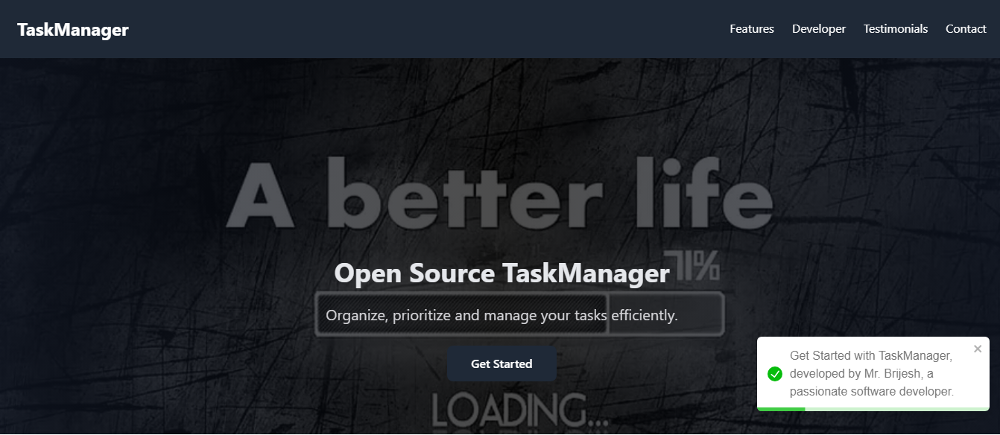
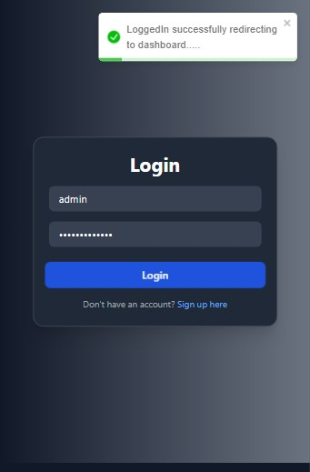
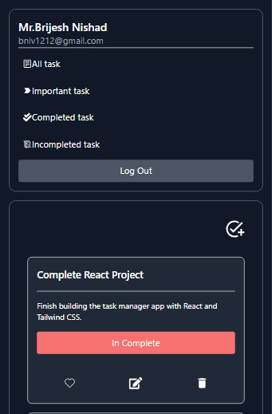
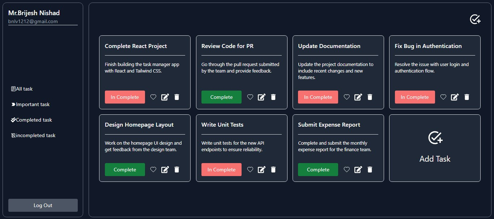

# Task Manager Web App

A production-ready Task Manager Web App for efficient task management with user roles, input validation, and a responsive interface.

---

   <!-- First Image -->
     

   <!-- Middle Images in a Row -->
   

       
       
   
  

   <!-- Last Image -->
   

### Features
- **Task Management**: Add, edit, delete, and prioritize tasks.
- **User Roles**: regular user roles.
- **Validation**: Input constraints and robust form validation.
- **Responsive Design**: Works across devices.
- **Testing Ready**: Includes testing assets.

---

### Tech Stack
Frontend: React.js, HTML, CSS ,AOS(Animation) , Toastify-react ,react-icons 
Backend: Node.js, Express.js ,JWT,bycrypt,joi,body-parser
Database: MongoDB  
Authentication: JWT-based login and registration

---

### Project Structure
TASKMANAGER
   -client(Frontend)
   -server(Backend)
   -testing-clips(Screenshots)

---

### Setup and Usage
1. Clone the repository:  
   `git clone https://github.com/tecresearch/taskmanager.git && cd taskmanager`

2. Install dependencies:  
   `cd client && npm install && npm run dev`

3. Run the server:  
   ` cd server && npm start`

4. Access the app at:  
   `http://localhost:5173`

---

**License**: MIT  
Ready for production. 🚀
